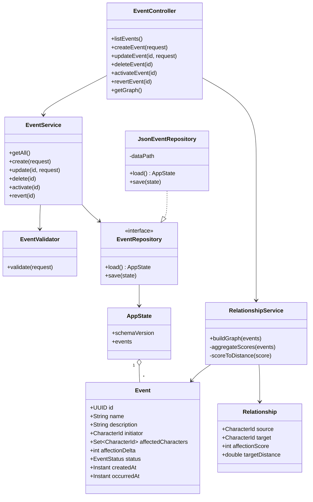
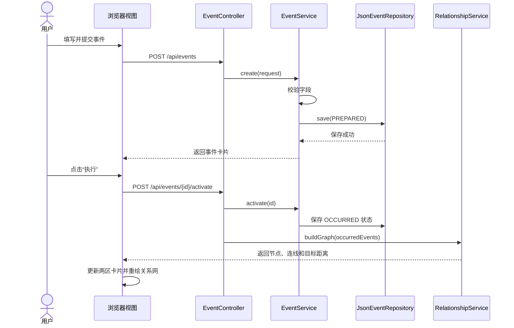
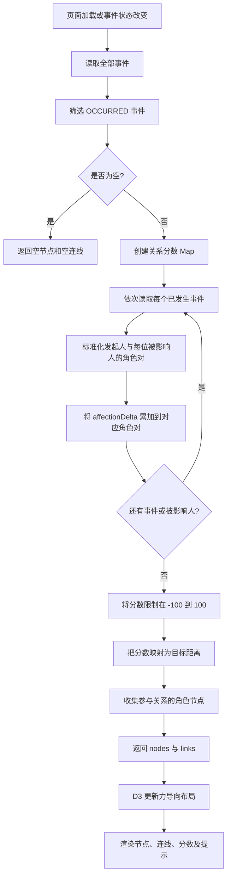
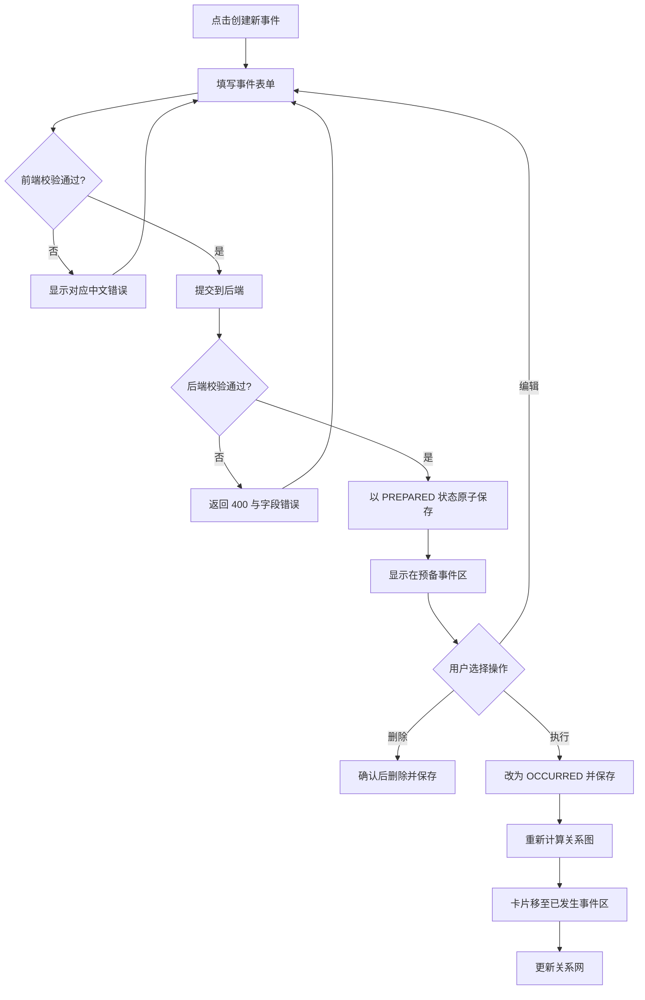

# 《雷雨》人物关系网项目计划

## 1. 项目目标

开发一个可离线运行的中文交互式网页应用，用事件卡片记录《雷雨》人物之间的事件，并根据已经发生的事件动态生成角色关系网。

- 主要语言：Java、JavaScript、HTML、CSS
- 架构：MVC
- 交付形式：可在 macOS 和 Windows 运行的可执行 `.jar`
- 运行方式：JAR 启动本地 Java 服务，并在浏览器中访问本机页面
- 数据保存：本地 JSON 文件；无需联网或外部数据库
- 界面语言：中文，仅在技术上必要时使用英文

## 2. 需求范围

### 2.1 核心功能

1. 创建事件卡片：
   - 事件名称：必填，可编辑
   - 事件描述：必填，最多 50 个中文字符
   - 发起人：从固定角色表中单选
   - 被影响人：从固定角色表中多选，至少一人，不可包含发起人
   - 好感度变化：整数，范围 `-10` 至 `10`
2. 新建事件先进入“预备事件”区，不影响关系网。
3. 用户将预备事件执行后，事件进入“已发生事件”区，并影响关系网。
4. 关系网在没有已发生事件时保持空白。
5. 已发生事件中的累计好感度越高，角色节点距离越近。
6. 页面刷新或应用重启后恢复事件及关系数据。

### 2.2 固定角色

- 周繁漪
- 鲁贵
- 鲁侍萍
- 鲁四凤
- 鲁大海
- 周朴园
- 周萍
- 周冲

> 注：原始需求写作“周浦园”，本计划采用《雷雨》角色的通行写法“周朴园”。实现前如需严格保留原文，可只修改角色常量。

### 2.3 第一版不包含

- 用户账号、云同步和多人协作
- 在线资源或第三方在线 API
- 自定义新增角色
- 复杂的时间线、章节管理和文本分析

## 3. 界面设计

参考 `Mock-ups.pdf` 的结构，桌面端采用三块区域：

```text
┌───────────────────────────────┬──────────────────────┐
│ 角色关系网                    │ 已发生事件           │
│                               │                      │
│  交互式节点与连线画布         │  可滚动事件卡片列表   │
│                               │                      │
├───────────────────────────────┴──────────────────────┤
│ 预备事件                              [创建新事件]    │
│ 可滚动事件卡片列表；执行事件后移至已发生事件区        │
└──────────────────────────────────────────────────────┘
```

### 3.1 视觉与交互原则

- 延续 Mock-up 的深蓝色标题块和清晰分区，并增加卡片阴影、间距和状态反馈。
- “创建新事件”打开表单对话框；编辑预备事件时复用同一表单。
- 事件卡片显示名称、描述、发起人、被影响人及好感度变化。
- 好感度正值使用暖色/绿色提示，负值使用冷色/红色提示，零值使用中性色。
- 预备事件卡片提供“编辑”“删除”“执行”操作。
- 已发生事件默认只读；提供“撤回到预备事件”可重新计算关系网。
- 图中节点支持拖动、悬停查看角色信息；连线悬停显示累计好感度。
- 空状态使用中文提示，例如“执行第一个事件后，这里将生成角色关系网”。
- 小屏幕下改为单列顺序：关系网、已发生事件、预备事件。
- 所有表单元素支持键盘操作，并提供明确的错误提示。

## 4. 技术方案

### 4.1 后端

- Java 17
- Spring Boot（内嵌 Web 服务器、REST API、静态资源打包）
- Jackson（JSON 序列化）
- Maven Wrapper（统一构建环境）
- JUnit 5（单元及集成测试）

选择本地 JSON 而非数据库，可避免跨平台原生数据库依赖，使同一个 JAR 更容易在 macOS 和 Windows 上运行。

### 4.2 前端

- 原生 JavaScript ES Modules
- HTML5 + CSS3
- D3.js 的本地打包版本，用于力导向关系图
- 不引用 CDN，所有资源包含在 JAR 中

### 4.3 本地存储

- 默认数据目录：用户目录下的 `.thunderstorm/`
- 主数据文件：`events.json`
- 保存策略：先写临时文件，再原子替换主文件，降低异常退出造成文件损坏的风险
- 启动策略：文件不存在时创建空数据；内容损坏时保留备份并给出可理解的错误

## 5. 目录架构

```text
thunderstorm/
├── pom.xml
├── mvnw
├── mvnw.cmd
├── README.md
├── PLAN.md
├── PROMPT.md
├── Mock-ups.pdf
├── src/
│   ├── main/
│   │   ├── java/com/thunderstorm/
│   │   │   ├── ThunderstormApplication.java
│   │   │   ├── controller/
│   │   │   │   ├── EventController.java
│   │   │   │   └── AppController.java
│   │   │   ├── model/
│   │   │   │   ├── CharacterId.java
│   │   │   │   ├── Event.java
│   │   │   │   ├── EventStatus.java
│   │   │   │   ├── Relationship.java
│   │   │   │   └── AppState.java
│   │   │   ├── dto/
│   │   │   │   ├── EventRequest.java
│   │   │   │   ├── EventResponse.java
│   │   │   │   └── GraphResponse.java
│   │   │   ├── service/
│   │   │   │   ├── EventService.java
│   │   │   │   └── RelationshipService.java
│   │   │   ├── repository/
│   │   │   │   ├── EventRepository.java
│   │   │   │   └── JsonEventRepository.java
│   │   │   ├── validation/
│   │   │   │   └── EventValidator.java
│   │   │   └── exception/
│   │   │       ├── ApiExceptionHandler.java
│   │   │       └── DataStorageException.java
│   │   └── resources/
│   │       ├── application.properties
│   │       └── static/
│   │           ├── index.html
│   │           ├── css/
│   │           │   ├── variables.css
│   │           │   ├── layout.css
│   │           │   └── components.css
│   │           ├── js/
│   │           │   ├── app.js
│   │           │   ├── api.js
│   │           │   ├── state.js
│   │           │   ├── constants.js
│   │           │   ├── views/
│   │           │   │   ├── event-card-view.js
│   │           │   │   ├── event-form-view.js
│   │           │   │   └── graph-view.js
│   │           │   └── vendor/
│   │           │       └── d3.min.js
│   │           └── assets/
│   │               └── icons/
│   └── test/
│       ├── java/com/thunderstorm/
│       │   ├── service/
│       │   ├── repository/
│       │   └── controller/
│       └── resources/
│           └── fixtures/
└── docs/
    ├── api.md
    └── screenshots/
```

## 6. MVC 与基本 UML 设计

### 6.1 MVC 职责

- Model：事件、角色、状态、关系边，以及本地持久化数据。
- View：中文页面、事件卡片、事件表单和关系网画布。
- Controller：REST 请求、输入校验入口和响应转换。
- Service：事件状态变更、关系累计与图数据生成。
- Repository：JSON 文件的读取、写入和故障保护。

### 6.2 类图



### 6.3 页面与 API 交互图



## 7. 数据与 API 设计

### 7.1 事件状态

- `PREPARED`：预备事件，可编辑、删除或执行
- `OCCURRED`：已发生事件，参与关系计算

### 7.2 建议 API

| 方法 | 路径 | 用途 |
|---|---|---|
| `GET` | `/api/events` | 获取全部事件并按状态分组 |
| `POST` | `/api/events` | 创建预备事件 |
| `PUT` | `/api/events/{id}` | 编辑预备事件 |
| `DELETE` | `/api/events/{id}` | 删除预备事件 |
| `POST` | `/api/events/{id}/activate` | 将事件移入已发生区 |
| `POST` | `/api/events/{id}/revert` | 将事件撤回预备区 |
| `GET` | `/api/graph` | 获取当前关系图数据 |
| `GET` | `/api/characters` | 获取固定角色列表 |

### 7.3 JSON 数据示例

```json
{
  "schemaVersion": 1,
  "events": [
    {
      "id": "7de9c590-5dba-4c89-a930-a7c920c71691",
      "name": "花园相遇",
      "description": "周冲向四凤表达关心",
      "initiator": "ZHOU_CHONG",
      "affectedCharacters": ["LU_SIFENG"],
      "affectionDelta": 4,
      "status": "OCCURRED",
      "createdAt": "2026-07-28T08:00:00Z",
      "occurredAt": "2026-07-28T08:05:00Z"
    }
  ]
}
```

## 8. 关系计算算法

### 8.1 规则

1. 只处理状态为 `OCCURRED` 的事件。
2. 一个事件为“发起人 - 每位被影响人”分别建立一条关系贡献。
3. 第一版将关系按无向边展示；同一角色对的所有好感度变化相加。
4. 累计分数限制在 `[-100, 100]`，避免极端事件使图形失控。
5. 只显示至少参与过一次已发生事件的角色；因此首次事件前关系网为空。
6. 关系距离采用单调递减映射：

```text
normalized = (clamp(score, -100, 100) + 100) / 200
distance = MAX_DISTANCE - normalized × (MAX_DISTANCE - MIN_DISTANCE)

建议：MIN_DISTANCE = 70 px，MAX_DISTANCE = 300 px
```

这样，好感度越高，目标距离越短；好感度越低，目标距离越长。D3 力导向布局同时使用轻微斥力和边界约束，以减少节点重叠。

### 8.2 算法流程图



### 8.3 事件操作流程图



## 9. 输入校验与错误处理

- 名称去除首尾空格后不能为空，并设置合理长度上限（建议 30 字）。
- 描述按 Unicode 字符数量计算，最多 50 个字符，而不是按字节计算。
- 发起人必须来自固定角色列表。
- 被影响人至少一位、不得重复、不得包含发起人。
- 好感度必须是 `-10` 至 `10` 的整数。
- 仅 `PREPARED` 事件允许编辑或删除。
- 不信任前端输入，前后端执行相同的关键校验。
- API 使用一致的错误结构：错误码、中文信息、字段错误。
- 保存失败时不更新内存状态，并在界面提示用户重试。

## 10. 测试与验收

### 10.1 自动化测试

- `EventValidator`：空字段、描述 50/51 字、角色冲突、好感度边界。
- `RelationshipService`：正数拉近、负数拉远、多事件累计、多被影响人、空事件。
- `JsonEventRepository`：首次启动、读写回环、原子保存、损坏文件处理。
- Controller 集成测试：成功响应、无效请求、状态转换和错误码。
- 前端关键函数：表单序列化、中文字符计数、状态渲染。

### 10.2 手工验收

1. 无已发生事件时，关系网为空。
2. 创建事件后只出现在预备区，关系网不改变。
3. 执行事件后卡片移至已发生区，相关角色和连线出现。
4. 增加正向好感事件后节点更近；增加负向事件后节点更远。
5. 多名被影响人分别与发起人建立关系。
6. 刷新页面及重启 JAR 后数据仍存在。
7. 断网时全部功能可用。
8. 同一个 JAR 在 macOS 和 Windows 的 Java 17 环境运行。
9. 常见桌面与窄屏尺寸下无内容遮挡或无法操作的问题。

## 11. 实施阶段

1. 项目骨架：建立 Maven/Spring Boot 工程、MVC 包结构和静态页面入口。
2. 数据层：完成领域模型、JSON Repository、原子保存及校验。
3. API 层：完成事件 CRUD、状态转换和统一错误响应。
4. 页面层：实现 Mock-up 三分区布局、事件卡片及创建/编辑表单。
5. 关系图：实现关系累计、距离映射及 D3 力导向图。
6. 联调完善：空状态、加载状态、错误提示、撤回及响应式界面。
7. 验证交付：运行测试，执行 macOS/Windows JAR 启动检查，补充 README。

## 12. 完成标准

- 所有核心需求和手工验收场景通过。
- 页面默认及主要操作均使用中文。
- 应用不依赖网络，所有前端依赖打包进 JAR。
- 本地事件持久化可靠，异常不会静默丢失已有数据。
- `mvn clean package` 生成单一可运行 JAR。
- README 清晰说明 Java 版本、启动命令、数据位置和重置方法。
